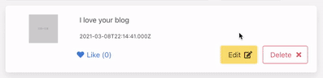

# WEEK11-EXERCISE
Week 11 Exercise - Linking Front-end with Back-end

## Start Backend Server
```
$ git clone https://github.com/it-web-pro/WEEK10-EXERCISE.git
$ cd backend
$ npm run serve
```

## Start Frontend Server
```
$ cd frontend
$ npm run serve
```

###Exercise

___

1. เมื่อกดปุ่ม Like ที่ comment ให้ไปเรียก API สำหรับเพิ่ม like ให้ Comment และแสดงตัวเลขของ Like ที่เพิ่มขึ้นด้วย
___

2. เมื่อกดปุ่ม delete ให้มี popup confirm ถ้ากด OK ก็ให้ยิง API ให้ลบ Comment จาก Database
> hint : ดูการใช้งาน Confirm ได้[ที่นี่](https://www.w3schools.com/jsref/met_win_confirm.asp)
___

3. ใน comment จะมีปุ่ม edit อยู่ โดยเมื่อกดแล้วจะทำการเปลี่ยนข้อความของ comment ให้เป็น input และมีข้อความเก่าใน input ด้วย และปุ่ม edit กับ delete จะกลายเป็นปุ่ม save edit comment และปุ่ม cancel 

โดยปุ่ม save edit comment เมื่อกดแล้วจะ update ค่าใหม่ลงใน database และเปลี่ยนกลับเป็น comment แบบเดิมที่แก้ไขข้อมูลแล้ว ส่วน cancel คือกลับไปเป็น comment แบบเดิมที่ยังไม่แก้ไข
___
####Extra
4. ทำการออกแบบการ Update ข้อมูลของ Blog รวมไปถึงรูปภาพของ Blog ด้วย โดยมีข้อกำหนดดังนี้
    1. หน้า Update ข้อมูลของ Blog จะมี Url คือ `/blogs/update/:id` และจะมีไฟล์หน้า Update มาให้แล้ว ชื่อว่า `views/blogs/UpdateBlog.vue`
    2. ในหน้า Update Blog จะมีฟอร์มมาให้ เมื่อเข้ามาในหน้านี้ ให้ทำการดึงข้อมูลดั้งเดิมของ Blog นั้นๆ ออกมาใส่ใน Form ที่มีให้ โดยใช้ params id ที่อยู่ใน URL กำหนดว่าจะดึงข้อมูล Blog ไหน
    3. รูปจะมี 2 ส่วน คือ รูปดั้งเดิมที่มีอยู่แล้ว กับรูปที่จะ Upload ขึ้นมาใหม่
        1. ***ในส่วนของรูปดั้งเดิม*** เมื่อกดปุ่ม Delete แล้วให้ทำการลบข้อมูลของรูปนั้นออกจาก Database โดยไม่ต้องกด Submit ***(ให้สร้าง API สำหรับลบรูปจาก id ขึ้นมาใหม่)***
        2. ในส่วนของรูปที่ Upload ขึ้นมาใหม่ เมื่อกดปุ่ม Delete จะทำการเอารูปนั้นออกจาก list ของรูปที่จะ Upload (ตรงส่วนนี้จะมี code ไว้ให้แล้ว)
    4. เมื่อกดปุ่ม Submit ข้อมูลของ Blog จะถูก Update และรูปภาพใหม่ที่เพิ่มขึ้นมาจะถูกเพิ่มลงใน Database
    5. ในการเลือกว่ารูปไหนจะเป็นรูปหลัก (ค่า main ของรูปจะเท่ากับ 1) ให้เลือกโดยการกดที่ดาวของรูปที่มีอยู่แล้ว  รูปไหนที่เป็น main=1 จะเป็นดาวทึบ และเมื่อเลือกเสร็จแล้วให้กดปุ่ม Update Main จะยิง api เพื่อเปลี่ยนค่า main ของรูปที่เป็นดาวทึบให้เป็น 1 และรูปอื่นที่เป็นดาวใสมีค่า main เป็น 0 (จะต้องสร้าง api ขึ้นเองอีกแล้ว)***ดังนั้นรูปจะต้องบันทึกลง Database ก่อนถึงจะตั้งเป็น main ได้*** และแต่ละ Blog จะมีรูปที่เป็น main = 1 ได้**แค่รูปเดียว**
    6. ถ้างงก็ดูตาม Gif นะครับ


___
